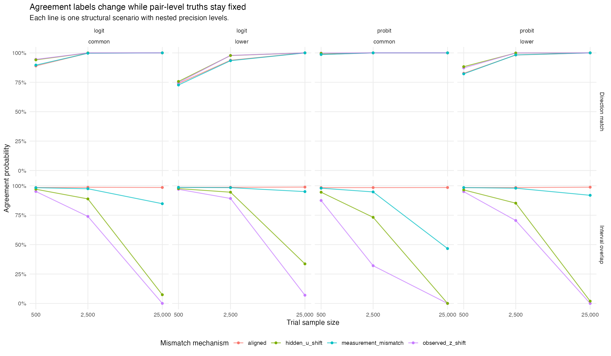

# A binary replication label changes with precision alone, and interval
overlap carries most of the change
Ahmad Sofi-Mahmudi
2026-08-01

# Abstract

**Background.** Agreement between an emulated and a randomized trial is
often reported as a binary label, such as whether the confidence
intervals overlap or whether the estimates share a sign. Catalog entry
BEN-02 states that such a label mixes estimand mismatch with random
error. We tested the pair-level part of that claim: whether the label
changes when the estimands are held fixed and only precision changes.

**Methods.** Sixteen structural scenarios crossed outcome family (logit,
probit), baseline risk (two levels) and four mismatch mechanisms
(aligned, observable effect-modifier shift, unavailable effect-modifier
shift, outcome misclassification). Each was run at three nested
precision levels (trial n of 500, 2,500 and 25,000; emulation n ten
times larger) with 10,000 replicates, 480,000 benchmark pairs in all.
True trial and emulation risk differences were computed by exact
finite-cell summation. The primary statistic S was the larger of two
operator-specific sensitivities, each the average over scenarios of the
range in agreement probability across precision levels. The registered
rule called the problem real if the lower 95% Monte Carlo limit of S
exceeded 0.10.

**Results.** S was 0.4915 (95% Monte Carlo interval 0.4903 to 0.4931),
supplied by the interval-overlap operator; direction agreement varied by
0.1244. Under an observable effect-modifier shift, overlap agreement
fell from 0.937 at the smallest samples to 0.018 at the largest, with
the true discrepancy unchanged. The underlying estimators had coverage
0.944 to 0.956 and no failures.

**Conclusions.** A binary agreement label, and the interval-overlap
label in particular, is largely determined by precision when the
estimands are fixed.

# Introduction

Benchmarking programs compare target trial emulations with the
randomized trials they emulate and summarize each pair by whether the
two “agree” ([1](#ref-wang2023duplicate)). A systematic review and
meta-analysis related concordance to design features using effect
correlation and standardized differences rather than a pass or fail
label ([2](#ref-bmj2025concordance)). BEN-02 argues that a binary label
conflates two things: whether the trial and emulation target the same
estimand, and how precisely each was estimated. Two pairs that estimate
the same pair of quantities can be labeled differently because one was
estimated more precisely.

That claim has a testable core. If estimands are held fixed and only
sample size changes, a label that measured estimand agreement would not
move. This study measures how far it moves. It addresses only this
pair-level component; heterogeneity across a benchmarking portfolio, the
choice of tolerance, and the calibration of graded metrics are outside
its scope.

# Methods

The study follows the ADEMP structure ([3](#ref-morris2019simulation));
the design was reviewed and revised before any code was written.

## Data-generating mechanism

Each replicate contains an independent trial cohort and emulation cohort
with a binary outcome at one year. Covariates L1 ~ Bernoulli(0.5) and L2
~ Bernoulli(0.4) are shared; Z is an observed and U an unavailable
effect modifier. Trial treatment is randomized; emulation treatment
follows logit P(A = 1) = −0.40 + 0.80L1 − 0.60L2 + 0.70Z. The outcome
index is
$\eta = \alpha + 0.45L_1 - 0.35L_2 + 0.20L_1L_2 + 0.55Z + 0.30U + A(-0.85 + 0.65Z + 0.45U)$,
with a logit or probit link and two intercepts per link. The four
mismatch mechanisms are: aligned populations and measurement; an
observable shift in the prevalence of Z (0.35 in the trial, 0.65 in the
emulation); the same shift in the unavailable U; and emulation outcome
misclassification with sensitivity 0.85 and specificity 0.98. No
parameter was solved to produce a chosen discrepancy. Counts at the
three precision levels are nested multinomial increments, so the
mechanism and estimands are identical across levels and only sampling
error changes.

## Estimands and truth

The trial and emulation marginal risk differences, their raw
discrepancy, and the discrepancy after standardizing the emulation to
the trial distribution of observed covariates. Truth was computed by
exact summation over the 16 covariate cells; the largest summation error
was 2.2e-16. True raw discrepancies ranged from 0 in the aligned
scenarios to 0.060
(<a href="#tbl-truth" class="quarto-xref">Table 1</a>).

## Methods evaluated

Trial effects were estimated by the difference in arm risks and
emulation effects by augmented inverse probability weighting. Two
illustrative binary operators were applied to each pair: direction
agreement (same sign) and interval overlap (the two 95% Wald intervals
intersect). As secondary methods that answer a stated tolerance
question, \|discrepancy\| below 0.02, a forced plug-in classifier and a
three-way procedure (aligned, mismatched or indeterminate from the 90%
interval of the discrepancy) were also evaluated.

## Primary statistic and decision rule

For each operator, V is the average over the 16 scenarios of the range
of its agreement probability across the three precision levels; S =
max(V_direction, V_overlap). Its 95% Monte Carlo interval came from
20,000 stratified paired bootstrap resamples. The problem is real for
this component if the lower limit exceeds 0.10, not real if the upper
limit is below 0.10, and inconclusive otherwise. The result is
uninformative if truth checks fail or estimator nonconvergence exceeds
1% in any scenario.

# Results

## The estimators are sound

Across all scenarios, precision levels and estimands, coverage ran from
0.9442 to 0.9557 and absolute bias was at most 0.00086. The
nonconvergence rate was 0 in every scenario. Label changes below are
therefore not an estimation artifact.

## The primary statistic

S = 0.4915, 95% Monte Carlo interval 0.4903 to 0.4931. The lower limit
exceeds 0.10 by about 538 Monte Carlo standard errors. The registered
branch is that the problem is real for the pair-level component.
Interval overlap supplies S; direction agreement varies by 0.1244, a
quarter as much.

## Where the change occurs

<a href="#tbl-agree" class="quarto-xref">Table 2</a> gives agreement
probabilities averaged within mismatch mechanism. When the true
discrepancy is zero (aligned), overlap agreement is near 0.99 at every
precision and direction agreement rises from 0.860 to 1 as the effects
become distinguishable from zero. When the estimands differ, overlap
agreement collapses as precision grows: under the observable Z shift
from 0.937 to 0.018, under the unavailable U shift from 0.964 to 0.108.
Pairwise, the overlap label of the same replicate changed between the
smallest and largest samples in 0.920 of pairs under the Z shift and
0.861 under the U shift
(<a href="#fig-agree" class="quarto-xref">Figure 1</a>).

Table 1: True trial risk difference and raw discrepancy (emulation minus
trial) by scenario.

| family | baseline | mismatch | trial RD | raw discrepancy | after Z standardization |
|:---|:---|:---|---:|---:|---:|
| logit | lower | aligned | -0.0217 | 0.0000 | 0.0000 |
| probit | lower | aligned | -0.0341 | 0.0000 | 0.0000 |
| logit | common | aligned | -0.0535 | 0.0000 | 0.0000 |
| probit | common | aligned | -0.0986 | 0.0000 | 0.0000 |
| logit | lower | observed_z_shift | -0.0310 | 0.0187 | 0.0000 |
| probit | lower | observed_z_shift | -0.0496 | 0.0311 | 0.0000 |
| logit | common | observed_z_shift | -0.0717 | 0.0363 | 0.0000 |
| probit | common | observed_z_shift | -0.1286 | 0.0600 | 0.0000 |
| logit | lower | hidden_u_shift | -0.0286 | 0.0139 | 0.0139 |
| probit | lower | hidden_u_shift | -0.0458 | 0.0234 | 0.0234 |
| logit | common | hidden_u_shift | -0.0659 | 0.0248 | 0.0248 |
| probit | common | hidden_u_shift | -0.1176 | 0.0381 | 0.0381 |
| logit | lower | measurement_mismatch | -0.0217 | 0.0037 | 0.0037 |
| probit | lower | measurement_mismatch | -0.0341 | 0.0058 | 0.0058 |
| logit | common | measurement_mismatch | -0.0535 | 0.0091 | 0.0091 |
| probit | common | measurement_mismatch | -0.0986 | 0.0168 | 0.0168 |

Table 2: Agreement probability averaged over the four scenarios in each
mismatch mechanism, by precision (trial n 500, 2500, 25000).

| operator  | mismatch             | small | medium | large |
|:----------|:---------------------|------:|-------:|------:|
| direction | aligned              | 0.860 |  0.979 | 1.000 |
| direction | hidden_u_shift       | 0.894 |  0.994 | 1.000 |
| direction | measurement_mismatch | 0.858 |  0.978 | 1.000 |
| direction | observed_z_shift     | 0.890 |  0.994 | 1.000 |
| overlap   | aligned              | 0.985 |  0.986 | 0.987 |
| overlap   | hidden_u_shift       | 0.964 |  0.855 | 0.108 |
| overlap   | measurement_mismatch | 0.984 |  0.972 | 0.796 |
| overlap   | observed_z_shift     | 0.937 |  0.664 | 0.018 |

Figure 1: Agreement probability by trial sample size. Each line is one
structural scenario; the truth is fixed along each line.

## Procedures that answer a tolerance question

Treating \|discrepancy\| \< 0.02 as the question, the forced plug-in
classifier made a wrong definitive call in 0.407 of pairs at the
smallest samples and 0.062 at the largest. The three-way procedure kept
wrong calls at 0.019 and 0.003 by declining to decide in 0.945 and 0.309
of pairs. A procedure that reports indeterminacy separates precision
from discrepancy; a binary label cannot.

# Discussion

Holding the estimands fixed and changing only precision moved the
probability of an interval-overlap “agreement” by about half on average.
The direction of the movement depends on the truth: with no discrepancy,
overlap is stable; with any discrepancy, more precision produces
“disagreement”. A binary overlap label therefore reports, in large part,
how large the two studies were. Direction agreement is less exposed but
moves the other way, towards agreement, as precision grows, including
when the estimands differ.

For benchmarking, this supports reporting the discrepancy on the effect
scale with its uncertainty, and, where a decision is needed, a tolerance
procedure that can return “indeterminate”, as the catalog entry
proposes.

## What this study does not establish

S is a maximum over two illustrative operators, so the result is an
at-least-one-operator claim: it shows that interval overlap is
materially precision-sensitive, not that every binary label is. It holds
for these 16 scenarios and three nested precision levels, on the
risk-difference scale at a single horizon. It says nothing about
heterogeneity across a benchmarking portfolio, about how a tolerance
should be chosen, or about graded measures already in use.

## Review

The design review returned unsound with three fatal findings, all
resolved before any code was written: it answered a neighboring
question, its mechanism solved a parameter to produce the discrepancies
it then measured, and its decision rule had an unreachable negative
branch. The results were reviewed in a fresh context that did not see
this summary and returned supported, with one minor finding on scope.

# Data and code availability

Code, protocol and result files:
<https://github.com/choxos/TTE-open-problems/tree/main/studies/BEN-02-pair-level-precision-sensitivity>.
The registered design is
`documentation/studies/designs/BEN-02-*-revised.json`.

# References

1.
Shirley V. Wang, Sebastian
Schneeweiss, RCT-DUPLICATE Initiative. Emulation of randomized clinical
trials with nonrandomized database analyses: Results of 32 clinical
trials. JAMA. 2023;329(16):1376–85.
doi:[10.1001/jama.2023.4221](https://doi.org/10.1001/jama.2023.4221)

2.
Canlong Wang, Dongfeng Tang, Peter
von Dadelszen, Chengsheng Ju, Lu Liu, Yanzhong Wang, Laura A. Magee.
Concordance between target trial emulation and randomised controlled
trials: Systematic review and meta-analysis. BMJ. 2026;393:e086810.
doi:[10.1136/bmj-2025-086810](https://doi.org/10.1136/bmj-2025-086810)

3.
Tim P. Morris, Ian R. White,
Michael J. Crowther. Using simulation studies to evaluate statistical
methods. Statistics in Medicine. 2019;38(11):2074–102.
doi:[10.1002/sim.8086](https://doi.org/10.1002/sim.8086)

