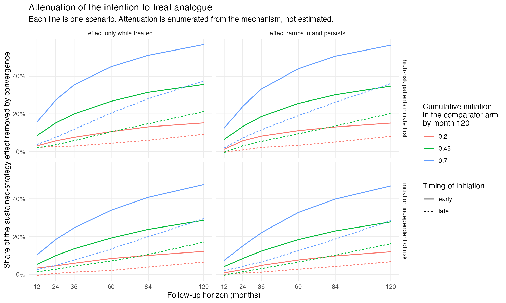
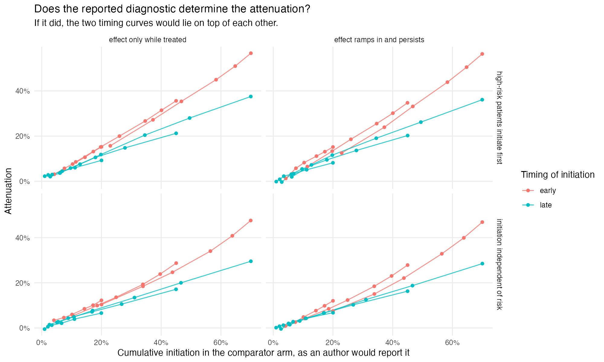

# Cumulative comparator-arm initiation at the horizon does not determine
the attenuation of the observational intention-to-treat analogue
Ahmad Sofi-Mahmudi
2026-07-31

# Abstract

**Background.** In an emulated trial of initiating treatment now versus
not now, patients assigned to “not now” often initiate later, so the
observational intention-to-treat analogue attenuates with follow-up.
Catalog entry CNF-01 proposes that authors report the cumulative
incidence of initiation in the comparator arm so readers can judge the
attenuation. Whether that number determines the attenuation has not been
tested.

**Methods.** Discrete-time simulation over 120 months, n = 4000 per
replicate, confounded baseline initiation and a treatment that works. A
24-scenario factorial crossed three convergence levels, two initiation
timings tuned to the same cumulative initiation at 120 months,
prognosis-dependent or independent initiation, and two
effect-persistence regimes; 1000 replicates each. Truth was enumerated
at two million individuals per scenario. The registered decision rule
called the diagnostic insufficient if matched early and late scenarios
differed in attenuation by at least 0.05.

**Results.** Standardization and stabilized inverse probability
weighting estimated the intention-to-treat analogue with absolute bias
at most 0.0019 and coverage 0.934 to 0.970. Median attenuation rose from
0.024 at one year to 0.245 at ten years, to a maximum of 0.567. At 120
months, matched pairs whose reported diagnostic agreed within 0.0005
differed in attenuation by 0.053 to 0.203; 9 of 12 pairs exceeded the
threshold by at least three Monte Carlo standard errors.

**Conclusions.** Within this grid, a single cumulative-initiation value
at the horizon does not determine the attenuation. Timing of initiation
and who initiates both move it, and the ambiguity is largest where
convergence is largest.

# Introduction

A target trial emulation of “initiate now” against “do not initiate now”
contrasts assignment strategies, not sustained treatment
([1](#ref-hernan2016bigdata)). Because the comparator arm is not
required to stay untreated, its members initiate over follow-up and the
two strategies converge. The resulting risk difference attenuates
towards the null with the horizon for reasons unrelated to efficacy.
Designs that name the later initiation explicitly, as dynamic
strategies, avoid the open-ended comparator
([2](#ref-cain2016switching)).

CNF-01 recommends two things: report the cumulative incidence of
initiation in both arms, and quantify by simulation how much attenuation
a given convergence produces at each horizon. The second presupposes
that the first carries the information needed. This study tests that
premise. If attenuation at a horizon is a function of cumulative
comparator-arm initiation at that horizon, a conversion table suffices.
If two emulations reporting the same value can carry materially
different attenuation, the reported number is insufficient and more must
be reported.

# Methods

The study follows the ADEMP structure ([3](#ref-morris2019simulation)).
The protocol was committed before the run
(`studies/CNF-01-convergence-attenuation/protocol.md`).

## Data-generating mechanism

Monthly time to 120 months. Baseline covariates L ~ N(0, 1) and Z ~
Bernoulli(0.4). Baseline initiation A0 follows logit P(A0 = 1) = −0.4 +
0.6L + 0.4Z, so assignment is confounded. Individuals with A0 = 0
initiate in later months with hazard
$\operatorname{expit}(\alpha_0 + \alpha_t g(t) + \alpha_L L)$, where
$g(t)$ is an early or late timing shape and $\alpha_0$ is tuned so that
cumulative initiation at 120 months among observed non-initiators equals
0.20, 0.45 or 0.70 under both shapes. $\alpha_L$ is 0 (initiation
independent of prognosis) or 0.6 (higher-risk patients initiate first).
Treated individuals do not discontinue. The monthly event hazard is
expit(−5.4 + 0.45L + 0.35Z − 0.90E(t)), where exposure E(t) is either
current treatment (transient) or a 12-month ramp after initiation
(legacy). There is no loss to follow-up and no competing event.

## Estimands

At horizons of 12, 24, 36, 60, 84 and 120 months: the intention-to-treat
analogue RD_ITT(h), the risk difference for assignment to initiate at
baseline against not, with later initiation left to run; the
sustained-strategy contrast RD_PP(h), always against never treated; the
attenuation A(h) = 1 − RD_ITT(h) / RD_PP(h); and the diagnostic C(h),
cumulative initiation among observed comparator-arm patients by h. Truth
was enumerated from the mechanism at two million individuals per
scenario.

## Methods evaluated

Two estimators of RD_ITT(h), to confirm that attenuation is a property
of the estimand and not of estimation: g-formula standardization over
(L, Z) and stabilized inverse probability of treatment weighting. The
method under test is the diagnostic C(120) as a predictor of A(120).

## Design and performance measures

Full factorial, 3 × 2 × 2 × 2 = 24 scenarios, 1000 replicates each.
Estimators were assessed by bias, empirical and model standard errors
and 95% coverage, each with a Monte Carlo standard error (MCSE). The
decisive quantity is the difference in attenuation between the early and
late member of each of the 12 pairs matched on C(120), with its MCSE.

## Registered decision rule

The diagnostic is sufficient if matched pairs differ in attenuation by
less than 0.05 at every horizon; necessary but not sufficient if they
differ by 0.05 or more; and the premise fails if the estimators are
biased for RD_ITT. After the first results review, a pair was counted as
exceeding the threshold only if its difference exceeded 0.05 by at least
three MCSE.

# Results

## Estimation

Both estimators converged in every replicate. Across 288 scenario,
horizon and method cells, absolute bias was at most 0.0019 and coverage
ran from 0.934 to 0.970. 14 cells showed bias beyond three MCSE, to a
maximum of 4.2 MCSE; the largest such bias was 0.0019 on a true risk
difference of -0.162. This does not affect the decisive comparison,
which uses enumerated truth rather than estimates. The premise holds:
attenuation here is a property of the estimand.

## Attenuation grows with the horizon

Pooled across scenarios, median attenuation was 0.024 at 12 months,
0.119 at 60 months and 0.245 at 120 months
(<a href="#fig-attenuation" class="quarto-xref">Figure 1</a>). The
largest value, 0.567, arose with 70% convergence, early timing and
prognosis-dependent initiation: more than half of the sustained-strategy
effect was absent from the intention-to-treat analogue. Effect
persistence mattered least: transient and legacy regimes differed by at
most 0.034, at 24 months while the 12-month ramp was under way, and by
at most 0.014 at 120 months.

Figure 1: Attenuation of the intention-to-treat analogue by horizon.

## The decisive comparison

<a href="#tbl-pairs" class="quarto-xref">Table 1</a> shows the 12
matched pairs at 120 months. Their reported diagnostic agreed to within
0.0005, yet attenuation differed by 0.053 to 0.203. 9 of 12 pairs
exceeded 0.05 by at least three MCSE, at 5 to 46 MCSE. The remaining 3
sat within three MCSE of the threshold and are individually
inconclusive; all are at 20% convergence, where there is least
attenuation to misattribute. The difference grew with convergence: 0.053
to 0.070 at 20%, 0.116 to 0.145 at 45%, and 0.181 to 0.203 at 70%
(<a href="#fig-diagnostic" class="quarto-xref">Figure 2</a>).

Table 1: Matched early and late scenarios at 120 months. d_att is early
minus late attenuation; z is its distance above 0.05 in Monte Carlo
standard errors.

| C(120) | initiation | persistence | C early | C late | A early | A late | d_att |   MCSE |    z |
|-------:|:-----------|:------------|--------:|-------:|--------:|-------:|------:|-------:|-----:|
|   0.20 | neutral    | legacy      |  0.2000 | 0.2001 |   0.120 |  0.068 | 0.053 | 0.0040 |  0.7 |
|   0.20 | neutral    | transient   |  0.2000 | 0.1995 |   0.122 |  0.066 | 0.056 | 0.0038 |  1.7 |
|   0.20 | prognostic | legacy      |  0.2000 | 0.1999 |   0.152 |  0.082 | 0.070 | 0.0039 |  5.1 |
|   0.20 | prognostic | transient   |  0.2000 | 0.2002 |   0.153 |  0.093 | 0.060 | 0.0037 |  2.7 |
|   0.45 | neutral    | legacy      |  0.4498 | 0.4498 |   0.279 |  0.163 | 0.116 | 0.0037 | 17.6 |
|   0.45 | neutral    | transient   |  0.4503 | 0.4498 |   0.287 |  0.171 | 0.116 | 0.0035 | 18.7 |
|   0.45 | prognostic | legacy      |  0.4495 | 0.4500 |   0.348 |  0.202 | 0.145 | 0.0036 | 26.1 |
|   0.45 | prognostic | transient   |  0.4501 | 0.4501 |   0.356 |  0.212 | 0.144 | 0.0034 | 27.4 |
|   0.70 | neutral    | legacy      |  0.6999 | 0.7003 |   0.469 |  0.285 | 0.184 | 0.0035 | 38.6 |
|   0.70 | neutral    | transient   |  0.6998 | 0.7003 |   0.476 |  0.295 | 0.181 | 0.0033 | 40.1 |
|   0.70 | prognostic | legacy      |  0.6998 | 0.6997 |   0.564 |  0.361 | 0.203 | 0.0033 | 46.1 |
|   0.70 | prognostic | transient   |  0.7004 | 0.7001 |   0.567 |  0.375 | 0.192 | 0.0031 | 45.3 |

Figure 2: Attenuation against the reported diagnostic. If the diagnostic
determined attenuation, the early and late curves would coincide.

## Who initiates

Prognosis-dependent initiation raised attenuation at 70% convergence
from 0.476 to 0.567. It also separated the reported diagnostic from
initiation under assignment: among observed non-initiators C(120) was
0.700, while cumulative initiation in the whole population under
assignment to “not now” was 0.742. Baseline confounding leaves
lower-risk patients in the observed comparator arm, so the arm-level
number understates the convergence of the assigned strategy.

# Discussion

Reporting cumulative comparator-arm initiation at the horizon is not
enough to recover the attenuation it is meant to explain. Two emulations
that report the same value can differ in attenuation by up to 0.20 on a
scale where the whole effect is 1, because the value is blind to when
the comparator arm initiated and to who initiated. The ambiguity is
largest exactly where attenuation is largest.

A report that lets a reader interpret a null or small intention-to-treat
estimate therefore needs the initiation curve over follow-up, not its
endpoint, and some statement of how initiation relates to prognosis.
Where the question is about sustained treatment, a per-protocol or
dynamic-strategy estimand answers it directly
([1](#ref-hernan2016bigdata),[2](#ref-cain2016switching)).

## What this study does not establish

The diagnostic was held fixed only at 120 months. At earlier horizons
the early and late scenarios differ in C(h) by up to 0.269, so those
contrasts are not comparisons at equal C(h). The study shows that C(120)
alone is insufficient in this grid. It does not show that reporting C is
necessary, that the full curve is sufficient, or that a general
conversion from convergence to attenuation exists. Convergence runs in
one direction only: the comparator initiates and the treated arm never
discontinues. There is no loss to follow-up or competing event. Results
are on the risk-difference scale; a hazard ratio would add
non-collapsibility to the mechanism under study.

## Review

The design was reviewed before the run. The results were reviewed in
three rounds, each in a fresh context that saw the catalog entry, the
protocol and the result files but not this summary. Round 1 required
Monte Carlo uncertainty on the decisive quantity, which reduced the
pairs clearing the threshold from 12 to 9. Round 2 found an arithmetic
error in how the study reported bias: it was described as a share of the
attenuation but computed against the risk difference. Round 3 returned
supported with three minor findings on claim strength.

# Data and code availability

Code, protocol and result files:
<https://github.com/choxos/TTE-open-problems/tree/main/studies/CNF-01-convergence-attenuation>.
Raw replicate files regenerate from the recorded seed.

# References

1.
Miguel A. Hernán, James M. Robins.
Using big data to emulate a target trial when a randomized trial is not
available. American Journal of Epidemiology. 2016;183(8):758–64.
doi:[10.1093/aje/kwv254](https://doi.org/10.1093/aje/kwv254)

2.
Lauren E. Cain, James M. Robins,
Emilie Lanoy, Roger Logan, Dominique Costagliola, Miguel A. Hernán.
Using observational data to emulate a randomized trial of dynamic
treatment-switching strategies: An application to antiretroviral
therapy. International Journal of Epidemiology. 2016;45(6):2038–49.
doi:[10.1093/ije/dyv295](https://doi.org/10.1093/ije/dyv295)

3.
Tim P. Morris, Ian R. White,
Michael J. Crowther. Using simulation studies to evaluate statistical
methods. Statistics in Medicine. 2019;38(11):2074–102.
doi:[10.1002/sim.8086](https://doi.org/10.1002/sim.8086)

